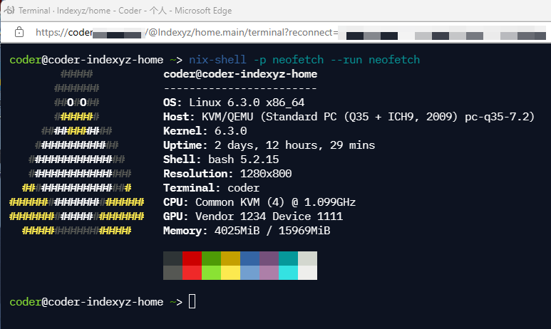

# coder-image
[](https://github.com/5aaee9/coder-image/actions/workflows/build.yaml)

Personal workspace image using in [coder](https://coder.com/)



## Setup

### Container

Update container image to `ghcr.io/5aaee9/coder-image:main`

### Nix Daemon

Update startup script in coder main agent resource

```
resource "coder_agent" "main" {
  os                     = "linux"
  arch                   = "amd64"
  startup_script_timeout = 180
  startup_script         = <<-EOT
    fix-jetbrains-server &> /tmp/jetbrains_fix.log &
    sudo nix-daemon &>/tmp/nix.log &

    code-server --auth none --port 13337 >/tmp/code-server.log 2>&1 &
  EOT
}
```
